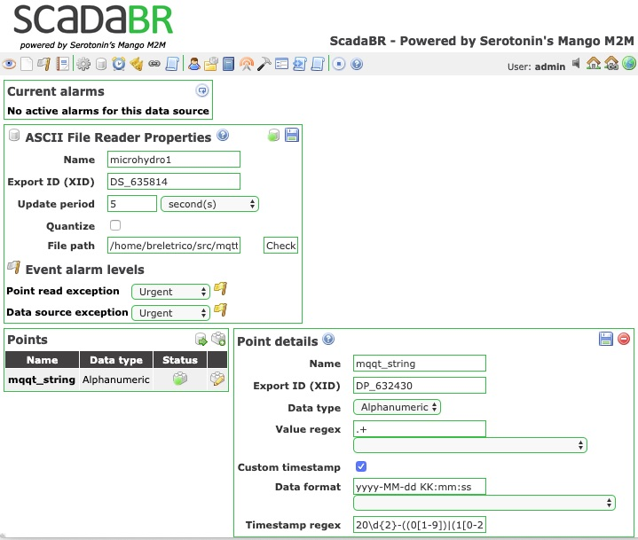
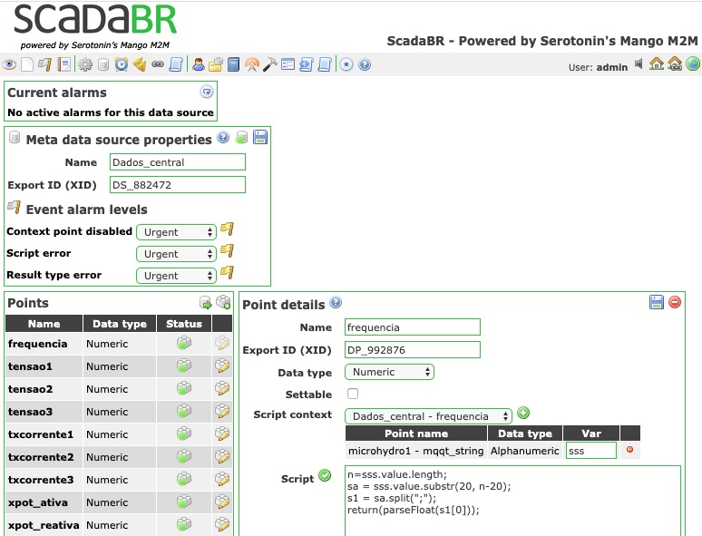

# Central de monitoramento e acionamento a distância de micro usinas de geração de energia elétrica em comunidades remotas

Rudivels @ março 2020

`/Users/rudi/src/Central_remota_usina`

# Apresentação

Geração descentralizada de energia elétrica é uma das opções para atender comunidades distantes das redes de distribuição com serviços de eletricidade. 
Há diversas tecnologias e fontes de energia que podem ser usados para este fim. também há diversas escalas que estes sistemas poder ter. Convencionamos neste trabalho 

- pico usina com capacidade instalada até 1kW; 
- micro usina com capacidade instalada ate 10 kW;
- mini usina com capacidade instalada até 100kW;

As tecnologias de conversão
Fontes de energia

- Motor de combustão interno com diesel
- Motor de combustão interno com biomassa
- Hidrelétrica
- Solar 
- Eólica
- Híbrida

Desafios tecnologicas
 
- Manutenção corretiva e preditiva
- Monitoramento da operação 
- Capacitação de operadores locais


# 1. Configuração geral do sistema

A operação no dia-a-dia dessas instalações deve realizado por técnicos e operadores locais. Entretanto, há a necessidade de acompanhamento do funcionamento por técnicos especialiados. Assim por meio de ligar os centrais de monitoramento nas localidades a um sistema supervisório. Acompanhamento de técnicos especilizados, podendo fazer o planejamento das manutenção preditivos baseado nos dados operacionais das instalações.  


Diagrama geral do sistema. 


Supervisory Control and Data Aquisition (Scada)

Este trabalho focará inicialmente em micro usina, hidrelétrica, monitoramento da operação e na medida que a pesquisa avança os demais itens serão adicionados.

.


# 2. Central de monitaramento e acionamento remoto

O projeto de um central de monitoramento e acionamento remoto de uma micro unidade geradora de energia elétrica para localidades remotas. 
Este central tem como objetivo monitorar a geração de energia elétrica e sua qualidade (potência, energia, fator de potência, interrupções de fornecimento, etc), e mandar essas informações via internet para um computador central que serão intergradas num sistema Supervisório Control and Data Aquisition (Scada).
Este monitoramente está descrito no repositório em <https://github.com/rudivels/MicroHydro_Scada> 
[link](MicroHydro_Scada/README.md)

# 3. Controlador de carga 

Além disso, o central tem que perimitir a configuração e/ou reprogramação remota de um controlador de carga (load controller) dessa micro unidade geradora de energia elétrica. Este controlador de carga é implementado num hardware dedicado com microcontrolador Arduino que controle a rede trifásico de um pico central hidrelétrico por meio de um banco de triacs. ainda será detalhada em repostório próprio. Os detalhes dessa implementação estão no repositório <https://github.com/rudivels/Controlador_carga_3fas> [link](Controlador_Carga_TriFasico)


# 4. Atualização remota do algoritmo de controle

Inotools

Acesso remoto à computador com IP dinâmico via Dataplicity

# 5 Sistema supervisório ScadaBR

O ScadaBR não tem implementado o protocolo MQTT de forma nato no seu sistema. A maneira encontrada para fazer a leitura da mensagem MQTT pelo SacdaBR foi gravar este mensagem em disco.
A mensagem enviada pelo central de monitoramento tem o seguinte formato:

```
s=data_hora +";"+ frequencia +";"+ tensão_fase_A + ";" + tensão_fase_B +";"+ tensão_fase_C  +";"+ Corrente_A +";"+ Corrente_B +";"+ Corrente_C +";"+ Potencia_Ativa +";"+ Potencia_Reativa +";"+ Fator_potencia
publish.single("ChapHydro", s ,hostname="mqtt.eclipse.org")
```
O string encaminhado tem este formato.

```
2020-05-25 00:07:00;60.0;220.0;220.0;220.0;10.0;11.0;15.0;2.20;2.30;0.72
```


No lado do receptor a mensagem é processado pela rotina.

```
msg = subscribe.simple("ChapHydro", hostname="mqtt.eclipse.org")
s=msg.payload
print("%s "% (s))
```

cliente MQTT desenvolvido em python implementando o cliente mqtt subscriber e gravando o dados recebido num arquivo. 
O ScadaBR leia este arquivo por meio do 
`Data source`
`ASCII File Reader`



Observe que se usou o regex para ler o string alfanumérico de uma vez do MQTT e também consegiu-se obter o horário e data do evento.

Para distrinjar o dado recebido pelo MQTT use-se o `Meta Data Source` para processar o string que foi enviado pelo comando:



Com rotinas de tratamento de string conseguiu-se separar os argumentos do string do MQTT usando Javascript
