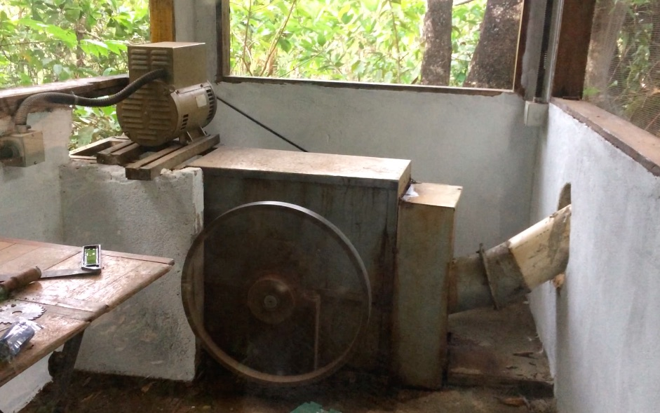
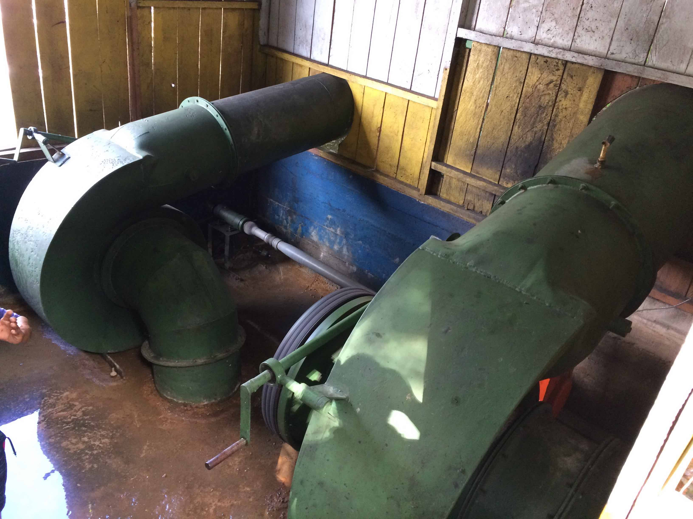
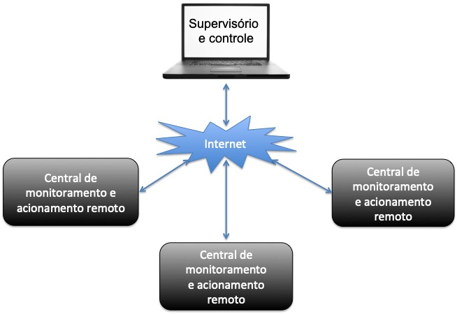
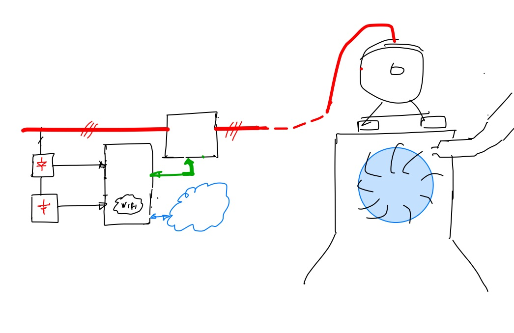
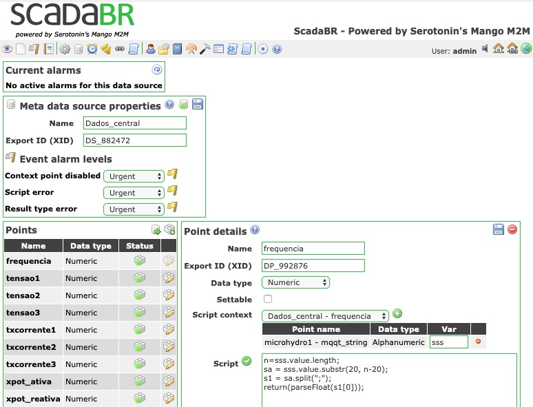
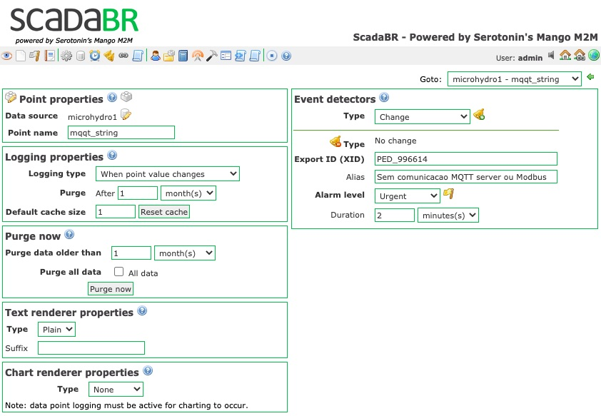

# Central de monitoramento e acionamento a distância de micro usinas de geração de energia elétrica em comunidades remotas

Rudivels @ março 2020

`/Users/rudi/Documentos/GitHub/Central_remota_usina`

# 1. Apresentação

Geração descentralizada de energia elétrica é uma das opções para atender comunidades distantes das redes de distribuição com serviços de eletricidade. 
Há diversas tecnologias e fontes de energia que podem ser usados para este fim. também há diversas escalas que estes sistemas poder ter. Convencionamos neste trabalho 

- pico usina com capacidade instalada até 1kW; 
- micro usina com capacidade instalada ate 10 kW;
- mini usina com capacidade instalada até 100kW;

As tecnologias de conversão
Fontes de energia

- Motor de combustão interno com diesel
- Motor de combustão interno com biomassa
- Hidrelétrica
- Solar 
- Eólica
- Híbrida

Desafios tecnologicas
 
- Manutenção corretiva e preditiva
- Monitoramento da operação 
- Capacitação de operadores locais

## 1.1. Exemplos de micro centrais hidrelétricos

### 1.1.1. Microcentral Imperial 
Microcentral de 2 kW que alimento sítio em Brazlândia-DF

Casa de maquinas


Turbina Pelton


Ficha técnica

| Especificação  | valor | unidade | xxx |
|----------------|:-----:|:-------:|-----|
| Potência       |  2    | kW      |     | 
| Vazão          |  xx   | lit/seg |     |
| Tipo turbina   | Pelton |   |  
| Quantidade turbinas | 1 | unidades |  
| Gerador | | |  

### 1.1.2. Microcentral Açaizal

Microcentral comunitário de 80 kW que fornece energia elétrica para a comunidade de Açaizal de Prata no município de Belterra região de Santarém estado do Pará 


Exemplo de turbina


Ficha técnica

| Especificação  | valor | unidade | 
|----------------|:-----:|:-------:|
| Potência       |  80   | kW      |   
| Vazão          |  xx   | lit/seg |  
| Tipo turbina   | Indalma |   |  
| Quantidade turbinas | 2 | unidades |  
| Gerador | | |  

### 1.1.3. Microcentral Aruã

Microcentral comunitário de 80 kW que fornece energia elétrica para a comunidade de Cachoeira Aruã no município de Santareém no estado do Pará.

Exemplo de microcentral hidrelétrica de Cachoeira Aruã - 




Ficha técnica

| Especificação  | valor | unidade | 
|----------------|:-----:|:-------:|
| Potência       |  80    | kW      |   
| Vazão          |  xx   | lit/seg |  
| Tipo turbina   | Indalma |   |  
| Quantidade turbinas | 2 | unidades |
| Gerador | | |  

# 2. Configuração geral do sistema

A operação no dia-a-dia dessas instalações deve realizado por técnicos e operadores locais. Entretanto, há a necessidade de acompanhamento do funcionamento por técnicos especialiados. Assim por meio de ligar os centrais de monitoramento nas localidades a um sistema supervisório. Acompanhamento de técnicos especilizados, podendo fazer o planejamento das manutenção preditivos baseado nos dados operacionais das instalações.  


Diagrama geral do sistema. 


Supervisory Control and Data Aquisition (Scada)

Este trabalho focará inicialmente em micro usina, hidrelétrica, monitoramento da operação e na medida que a pesquisa avança os demais itens serão adicionados.


# 3. Central de monitoramento e acionamento remoto

O projeto de um central de monitoramento e acionamento remoto de uma micro unidade geradora de energia elétrica para localidades remotas. 
Este central tem como objetivo monitorar a geração de energia elétrica e sua qualidade (potência, energia, fator de potência, interrupções de fornecimento, etc), e mandar essas informações via internet para um computador central que serão intergradas num sistema Supervisório Control and Data Aquisition (Scada).
Este monitoramente está descrito no repositório em <https://github.com/rudivels/MicroHydro_Scada> 
[link](MicroHydro_Scada/README.md)

# 4. Controlador de carga 

Além disso, o central tem que perimitir a configuração e/ou reprogramação remota de um controlador de carga (load controller) dessa micro unidade geradora de energia elétrica. Este controlador de carga é implementado num hardware dedicado com microcontrolador Arduino que controle a rede trifásico de um pico central hidrelétrico por meio de um banco de triacs. ainda será detalhada em repostório próprio. Os detalhes dessa implementação estão no repositório <https://github.com/rudivels/Controlador_carga_3fas> [link](Controlador_Carga_TriFasico)


# 5. Sistema supervisório ScadaBR

## 5.1. Descrição do ScadaBR





## 5.2. Procolo de leitura dos dados elétricos
O ScadaBR tem suporte para diversos protocolos de comunicacão. Um dois mais conhecidos é o protocolo Modbus IP/RTU. No nosso caso específico o central de monitoramento implementa o protocolo Modbus-RTU para ler os variáveis elétricos do multimedidor. Essa leitura é realizada a cada 10 segundos passando valores de tensão, corrente, potência e frequencia da micro usina. Em tese poderia-se ler diretamento do ScadaBR para o multimedidor usando Modbus-RTU. Entretanto, como entre o ScadaBR e o Multimedior há uma rede internet poderia-se implementar um link diretamente entre o sistema operacional lunix do Scada e o Raspberry e fazer um túnel para o Modbus-RTU. 

Entretanto a dificuldade neste sistema é que não temos um endereçamento IP fixo entre estes dois sistemas linux. Ou seja, há necessidade de um outro intermediário para estabelecer um canal de comunicação virtual entre os dois computadores.

Há diversos maneiras para implementar isso, e a opção escolhido foi o serviço de *Message Queuing Telemetry Transport (MQTT)*

Este sistema de comunicação usa o serviço de um intermediário ou *broker* para encaminhar as mensagens 

## 5.3. Assinante MQTT 

O cliente assinante ou *subscriber* permite a gente ler as mensagens que foram encaminhados pelo central local ao intermediário (*broker*). 
Há diversos nívels de serviço no MQTT com muitas funcionalidades. No nosso caso vamos pegar o caso mais simples sem nenhum mecanismo de verificação ou controle de entrega de mensagens.  

Usou-se como *broker* um servidor público aberto implementado pela <http://mqtt.eclipse.org>.

O ScadaBR não tem implementado o protocolo MQTT de forma nato no seu sistema. A maneira encontrada para fazer a leitura da mensagem MQTT pelo SacdaBR foi gravar este mensagem em disco.
A mensagem enviada pelo central de monitoramento tem o seguinte formato:

```
s=data_hora +";"+ frequencia +";"+ tensão_fase_A + ";" + tensão_fase_B +";"+ tensão_fase_C  +";"+ Corrente_A +";"+ Corrente_B +";"+ Corrente_C +";"+ Potencia_Ativa +";"+ Potencia_Reativa +";"+ Fator_potencia
publish.single("Topico", s ,hostname="mqtt.eclipse.org")
```
O string encaminhado tem este formato.

```
2020-05-25 00:07:00;60.0;220.0;220.0;220.0;10.0;11.0;15.0;2.20;2.30;0.72
```


No lado do receptor a mensagem é processado pela rotina.

```
msg = subscribe.simple("Topico", hostname="mqtt.eclipse.org")
s=msg.payload
print("%s "% (s))
```

cliente MQTT desenvolvido em python implementando o cliente mqtt subscriber e gravando o dados recebido num arquivo. 
O ScadaBR leia este arquivo por meio do 
`Data source`
`ASCII File Reader`


Observe que se usou o *regular expression (regex)* para ler o string alfanumérico de uma vez do MQTT e também consegiu-se obter o horário e data do evento. Entretanto, não foi possível separar os 9 valores embutidos no string usando regex. 
Gastei pelo menos uma 2 horas tentando forçar a barra com regex até me render e procurar outra solução. Uma ferramenta útil para experimentar com regex está no site <https://regex101.com/>.
Aparentemente a técnica de separação usando regex so funciona quando são até dois valores e o *timestamp*. 

Para distrinjar o dado recebido pelo MQTT use-se o `Meta Data Source` para processar o string que foi enviado pelo comando conforme tela a seguir:



Com rotinas de tratamento de string conseguiu-se separar os argumentos do string do MQTT usando Javascript

Depois de ter deixado o ScadaBR rodar durante 2 dias num netbook linux 32bits, percebeu-se que o processador Java estava muito carregado no sistema operacional e tinha um atraso entre o processamento do *Ascii File Reader* e o *Meta Data Source*. Aparentemente tinha uma fila de processamento do *Meta Data Source* provocado pela chamada a rotina de Javascript que fez com que os valores na tela do data view eram atualizadas pelos menos alguns minutos depois da atualização do string proviniendo do Asci file reader. Pode ser que a fila de processamento tem um atraso que vai se acumulando na medida que a máquina fica ligada. Houve um ajuste de reduzir o temp de atualização para 10 segundos, pois o MQTT manda recebe os dados num intervalo de 10 segundos, somando com isso o atraso da leitura do barramento Modbus-RTU. 

## 5.3.1. Assinante MQTT com aviso de queda de comunicação

Uma das limitações deste sistema é que o Scada não é avisado quando há alguma falha na comunicação. O scada tem como dar algum alarme por meio de um evento para avisar que não houve a atualização no valor gravado no disco pelo assinante mqtt.
Ou seja, se num determinado intervalo de tempo nõ houve atualização do *data point*  o sistema gera um alarm. A tela a seguir mostrar como é configurado essa opção. Aqui o *Data point* mqtt_string do *Data source* microhydro1 é monitorada para ver se munda num intervalo de 2 minutos. Se não tiver mundança no data *source* o sistema gera um alarme.



Essa opção avisa o operador da falha de comunicação, mas não atualiza os últimos valores lidos. Deve ter uma maneira para avisar ao data source para voltar para um valor padrão em caso dessa falha. Entretanto não conseguimos descobrir como fazer isso no ScadaBR.
 
A opção encontrada foi implementar uma nova funcionalidade no assinante MQTT para ele monitorar o estado do *broker* e se a mensagem esperado não chegar em tempo ou o *broker* sair do o ScadaBR é avisado e toma os devidos providencias. 
Essa opção está mostrado no código a seguir 

```
# códgo assinante broker novo. 
# com aviso de erro de comunicação

from datetime import datetime
import paho.mqtt.subscribe as subscribe
import time
import sys

if (len(sys.argv))==2 :
	 print ("# logfile  = ", sys.argv[1])
	 logfile=True
else :
     logfile=False 

msg = subscribe.simple("ChapHydro", hostname="mqtt.eclipse.org")
s=msg.payload
print("%s "% (s))

if (logfile == True) :
     f = open(sys.argv[1],"w")
     f.write(s)
     f.write("\n")
     f.close()
 
print("Publicou dados ")


```


  

